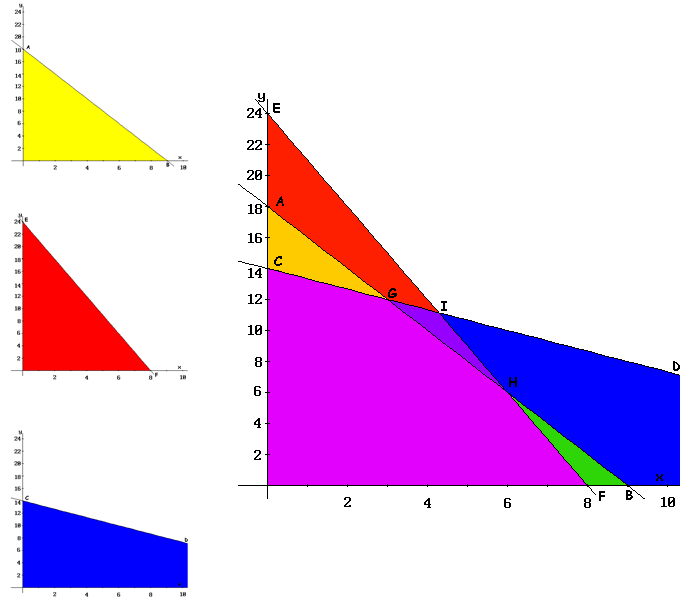

 

## Pagina de programacion linel
En esta paguina voy a mostrar las cosas mgnificas de mi estupendo curso de programacion lineal.

### Sympy
Aprendedimos mucho de sympy

### Enlaces
[Enlaces paguina de Python](https://www.python.org/)
[Github](https://github.com/juandiego2104/Programacion-Lineal/deployments)

## Problemas
 Maximizar  $$z=x_{1}+x_{2}$$

Sujeto a $$x_1 \geq 3$$

